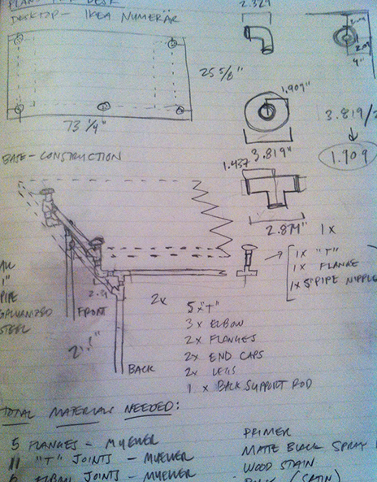

Over the last week and a half, I designed and constructed a new desk for my home office.  If you <a href="http://instagram.com/pmarsceill" title="Patrick Marsceill's Instagram">follow me on Instagram</a> you might have seen some of the progress photos that I've been posting.  I wanted to document my experience building this thing and what learned along the way. This was not only one of my favorite construction projects from a process perspective, but also my favorite finished product.

_First, a little backstory_&hellip; A few years ago, I saw <a href="http://www.apartmenttherapy.com/morgans-amazing-diy-shelving-97760">this post on Apartment Therapy</a> about constructing shelving from steel plumbing pipe. I instantly latched on to this idea and added it to the list of projects that I wanted to take on in my then&mdash;new house. If you're a home-owner, you know that this list quickly gets re-prioritized in favor of things leaking, mold growing, and whatever else requires immediate (and usually expensive) repair.  Needless to say, the pipe-shelving project had been in the back of my head for a few years.

About a month ago, I stumbled upon <a href="http://spacekat.github.com">Jessica's blog</a> through a link  that someone posted on Twitter about some of her work at Engine Yard. I then found my way to <a href="http://spacekat.github.com/blog/2012/07/31/steel-pipe-standing-desk/">this very detailed post about how she constructed a standing desk</a>, using similar materials and construction methods as the shelving unit mentioned above.  This immediately got the gears turning in my head and I spent a few days imagining how I could construct something like this.

Unlike Jessica's desk, I didn't want mine to be that of the standing variety.  I did some research and found <a href="http://www.apartmenttherapy.com/look-desks-and-68448">a few photos of other sitting desks that people had made out of plumbing pipe</a>. Based on these photos and Jessica's design, I sketched out some plans borrowing ideas from both.

Next, I took an inventory of everything I would need to execute this plan and headed off to <a href="https://www.lowes.com">Lowe's</a>. As Jessica noted, Lowe's will cut and thread the pipes for you right in the aisle. They also have pre-cut and pre-threaded pipes from about 1 inch through 20 inches in length.

### Parts required to build the frame

All parts galvanized steel, 1" diameter and the fittings made by Mueller

#### Fittings:
* 5 x Flanges
* 11 x "T" Joints
* 6 x Elbow Joints
* 4 x End Caps
* 16 x 'close' pipe nipple
* 1 x 4" pipe nipple

#### Pipes:
* 4 x 21.5"
* 2 x 28"
* 4 x 18"

#### Finishing Products:
* 1 bottle of spray degreaser, citrus scented
* 1 can of Rustoleum spray metal primer
* 1 can of Rustoleum matte black spray paint

When I got home, I decided to clean all the parts and quickly assemble the frame (without measuring or really tightening anything) just to make sure I had all the pieces I needed.  The saw and the pipe threading machine at Lowe's gets the pipes pretty greasy, so I used some spray degreaser and rags to clean each piece and remove any stickers.

The next weekend, it was time to prime and paint the frame.  I reconstructed the frame and measured all the fittings, legs, and connectors to ensure I had a symmetrical table before it was too late to turn back.  I put on one coat of primer, let it dry for about 2 hours, and then one coat of spray paint.  This actually used up the entire can of paint and if I could do it again, I would have bought another can for a second coat.

