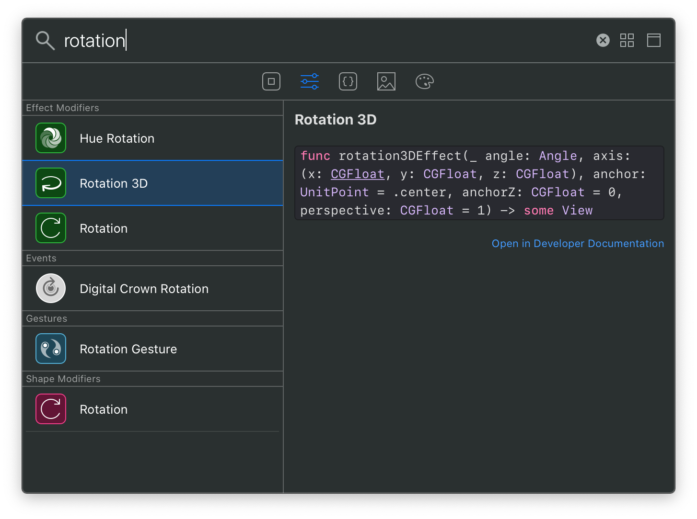
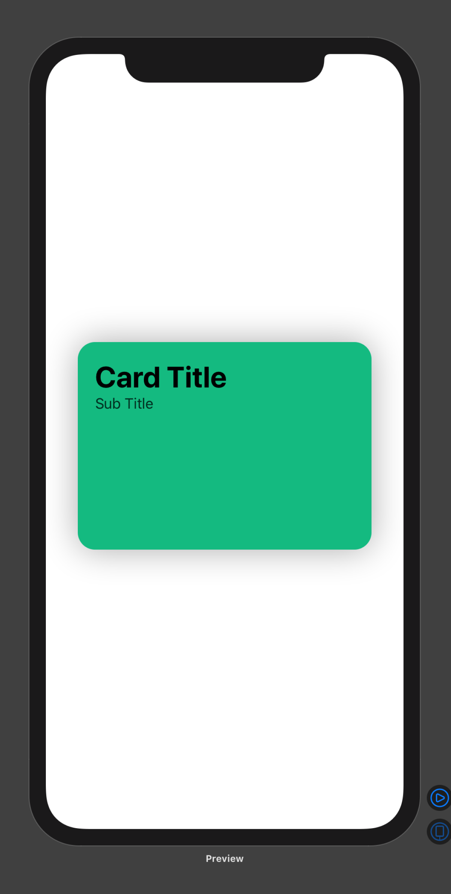
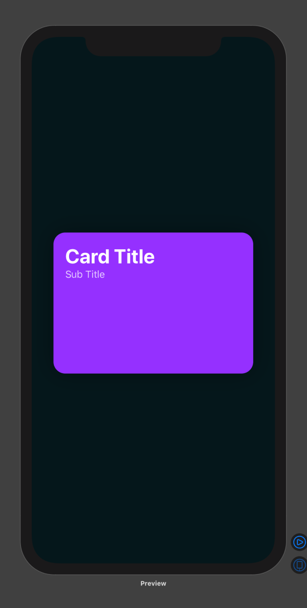

import BigImage from "../../src/components/big-img"
import ImageRow from "../../src/components/img-row"

In recent years, designing and building for the web has taken a few steps closer toward application development (for better or worse) with the advent of modern frameworks like React. These encourage a more app-centric approach to UI development through components and different ways of encapsulating logic and presentation layers. In the end though, the web still is — and probably always will be: markup, styles, and JavaScript served over a network to a browser that turns it into a UI. This protocol allows web developers to be productive very early-on in their journey because what you "write" is "what you get" and unlike compiled languages like Swift, there is no required build step before you can see the fruits of your labor. With the release of SwiftUI though, Apple has attempted to replicate a web developer's ease-of-entry with a live preview mechanism and an abstracted language for constructing interfaces. This was enough to pique my interest and over the last month, I began playing with SwiftUI through [Design+Code's SwiftUI](https://designcode.io/swiftui-course) course. Here are my initial impressions...

## Tooling

Let me start out by saying that XCode is an [IDE (integrated development environment)](https://en.wikipedia.org/wiki/Integrated_development_environment) and most modern web development tools are not. VSCode comes close-_er_, but it's really not the same thing. XCode has an editor, documentation, compiler, virtualization, and a rendering engine all-in-one -- including all the settings to boot. It feels big in every conceivable way to someone who isn't used to working with a tool of this scope. In this new version of XCode (version 11.3.1), Apple has added a new component called _Canvas_ that works exclusively with SwiftUI. Canvas is the real-time preview (+ inspector) that makes writing SwiftUI so compelling. With Swift _classic_ (and ObjectiveC) apps, every time code was edited, a manual build step was required before you could preview the app in a separate process. With SwiftUI + Canvas, the preview updates as-you-type(-ish) which is familiar to those of us using live-reload in our web browsers while developing web pages.

The Apple team has done a lot of things rigth in _not_ making this version of XCode overly complex to use, but coming from the light-weight world of Vim, VSCode, Atom, and Sublime Text, I do feel like sometimes I'm driving a tank -- and a very delicate one at that. Often times while writing code, response time feels sluggish and triggers syntax error statements that may or may not be accurate. I find myself deleting and writing the same line multiple times to try to get a "true" result from the change. SwiftUI _is_ in beta still, so I'll chalk this up to it not being production-ready yet.

Despite some of the bulkiness and current fragility, I do really appreciate having the niceties of a full IDE at my fingertips. Take the _Library_, as an example: it's a universal command palette that you can pull up while you're writing code to search for specific parts of the Swift/SwiftUI API to use inline. I love that it has the docs _right there_ and selecting an item inserts it right where I want it with placeholders for all the properties.



Another thing that I appreciate is the approach in integrating Canvas into XCode and how it is very reminiscent of the early versions of Framer Studio. For those that don't remember, this was the precursory product that came before Framer X: CoffeeScript on the left, live preview (with device chrome) on the right:

<BigImage>


</BigImage>

<BigImage>


</BigImage>

It certainly _feels_ like there was some inspiration there. It's also interesting to see how technology seemingly continues to pull development and design closer together. Framer Studio was a tool often used to prototype native app interactions, and now with the same level of code abstraction one can actually write the real UI for a native app -- animation, interaction, and even integrated into a data model. I'm actually quite surprised that it took Apple this long to create this sort of thing, but I have no idea how long SwiftUI has been in the works.

## Writing Swift/SwiftUI

I took an ObjectiveC class about five years ago and it wasn't even close to this easy to pick-up and just make stuff. It was only on day two of the four day class that I actually had anything running on a device. This is why being a web developer is awesome: you can make a production-ready webpage in minutes with default tools like Notepad or TextEdit, with zero configuration, and using the browser that comes with your OS. As you learn more about HTML and CSS, you can see exactly how the edits you make affect the outcome, and thats when making stuff gets _fun_. Apple has again done a great job of abstracting out the types of things that will give you the momentum to _keep going_ making them seem conceptually simple.

One such example is how the layout engine that produces variable width and height layouts (similar to flexbox in CSS). This uses the concepts of `Stacks` and `Spacer()s`. `Spacer` kind of reminds me of the old `spacer.gif` hack from the days of table based layouts in HTML, which brought a smile to my face as I typed it out every time.

```swift
// HStack creates a horizontal layout, Spacer() creates a flexible spacer (think flexbox with justify-content: space-between)
HStack {
    Text("Acme Corp")
    Spacer()
    Image("logo")
}
```

"Hello world!" is a thing of the past, SwiftUI it's more like, "Hello, beautiful UI complete with animations and dark-mode built-in!"

Here is an example of how to create a simple card UI using _out-of-the-box_ SwiftUI:

```swift
// Create a vertical layout for the card "frame"
VStack {
    // Create a horizontal layout to "push" the text to the left edge with a Spacer()
    HStack {
        // Create a vertical layout for each text component to stack on top of each other
        VStack(alignment: .leading) {
            Text("Card Title")
                // Style the text using system styles
                .font(.largeTitle)
                .fontWeight(.bold)
                // Use a color from a color set (a theming file) in the assets catalog, so that it will dynamically shift for dark and light mode
                .foregroundColor(Color("primary"))
            Text("Sub Title")
                .font(.headline)
                .fontWeight(.regular)
                .foregroundColor(Color("secondary"))
            Spacer()
        }
        Spacer()
    }
}
// Specify the size of the card and its styles
.frame(width: 300, height: 200)
.padding(20)
.background(Color("accent"))
.cornerRadius(20)
.shadow(radius: 20)
```

This will render the following in both dark and light mode, using the color sets that I defined in the asset catalog (which is like a special folder in your project where you keep all your images and color properties for theming).

<ImageRow>





</ImageRow>

Despite its quirks and unfamiliarity, I am already a fan of SwiftUI. Intentionally or not, Apple is now courting folks like me who grew up building on web tech stacks. Because in many ways SwiftUI feels like the tools I am already using, I can absolutely see myself building out the UI (and more) of an entire app with this in a matter of weeks. Who knows, maybe I'll get something in the App Store this year?