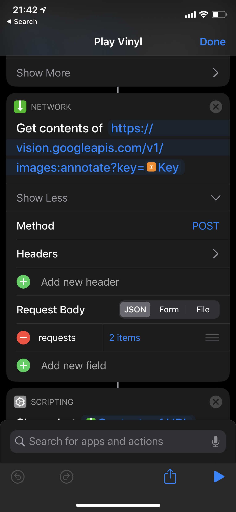
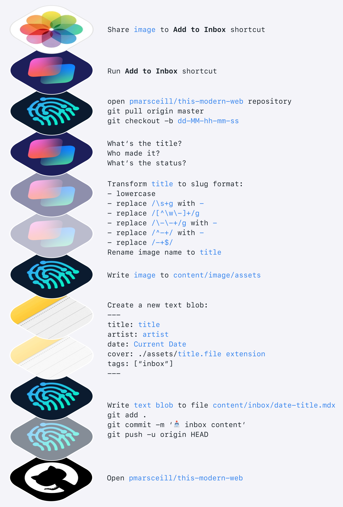
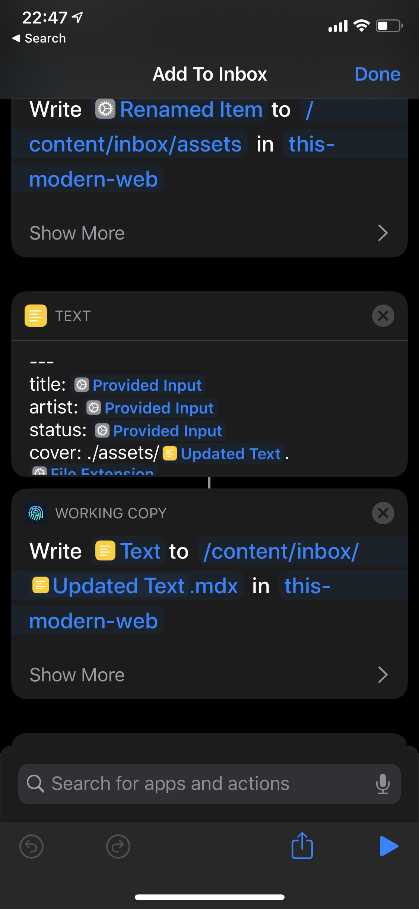

import BigImage from "../../src/components/big-img"
import ImageRow from "../../src/components/img-row"
import SmallImage from "../../src/components/small-img"
import Video from "../../src/components/video"

I love spending short chunks of time programming things that are _just for me_. It's a satisfying indulgence, like cooking an intricate dinner for one or building a scale model of your own house that is  only on display for you. Lately, [Siri Shortcuts](https://developer.apple.com/siri/) have filled this need quite well because I find them accessible, intuitive enough to quickly get productive, and malleable enough to solve "real problems".

Siri Shortcuts aren't new, but as more developer-centric apps begin using the [SiriKit API](https://developer.apple.com/documentation/sirikit), developers now have increased potential for upping their productivity levels on iOS (and iPadOS) devices. One great example of this is the [Working Copy](https://workingcopyapp.com/) app. Working Copy is a Git client for iOS and iPadOS, which in itself is handy for editing and pushing code from your iPhone or iPad. Outside of being a nice Git client, the team has also built a deep integration with SiriKit, opening up entirely new workflows not even found on MacOS. Using Shortcuts, we can now access many individual tasks within specific apps (such as basic Git commands from within Working Copy) as pieces of larger workflows that pass data between other Siri-enabled apps.

## What are Siri Shortcuts anyway?

Before getting into examples of how to set up your device with handy dev-centric Shortcuts, let's review exactly what they are and some of the core concepts around them.

<SmallImage>

</SmallImage>

iOS 13 brought a new Shortcuts app to our devices. This app is the engine that allows us to create specific workflows using individual tasks, called actions, from many individual apps and connect them together into one string of events called a shortcut. These shortcuts are accessible from OS-level context menus (primarily the _share sheet_), kicked off manually from the home screen, or automatically run at a certain time interval.

While Shortcuts can be used to accomplish any number of tasks (like getting walking directions to the nearest coffee shop), they are especially valuable to me in transforming my iOS devices into automated development tools. Let's dig in to some common use-cases.

## Running a simple curl command

My initial motivation was fairly niche; I wanted to build a shortcut that used the camera on my iPhone to take a photo of an album cover, identify what it was, and then add that album to a Spotify playlist. It's handy when shopping for vinyl or cataloging my existing record collection and creating a digital version on Spotify.

I found that the simplest way to identify the contents of a photo was to use Google Vision. Specifically, the image annotation API. After researching several ways to hit this API from my phone, I stumbled upon the _Get contents of `<url>`_ action could be used to send curl commands. This made hitting the Google Vision API with an encoded version of the photo that I just took feel too easy. This specific action is built into Shortcuts itself (not tied to any particular app) and has many uses. It can hit API endpoints, grab an RSS feed, download and parse the contents of a webpage, or grab any data that is backed by a URL. As I learned, it is also very handy for making a single curl command and getting a response back. A more complicated API integration may be better served using another app with Shortcuts support (like Scriptable, more on this later) to handle more advanced back-and-forth and parsing of an API response.

<SmallImage>

</SmallImage>

Another use for this action that I am eager to play with is [triggering a GitHub Action workflow run](https://help.github.com/en/actions/configuring-and-managing-workflows/configuring-a-workflow#triggering-a-workflow-with-events) using the [`repository_dispatch`](https://developer.github.com/v3/repos/#create-a-repository-dispatch-event) event via curl that is kicked off from a shortcut. There are a ton of possibilities with this flexible action allowing your device to interface with any number of services fronted by public web APIs.

## Writing content to a static site (Gatsby, Next.js, Jekyll, etc..)

I use this workflow the most of any in my toolkit. It recently came up in conversation with Brian Lovin  (fellow GitHubber) after reading [his post about how he architected a way to add links to his Bookmarks page](https://brianlovin.com/overthought/cookies-authenticate-next-js-apollo-graphql-requests) via adding authentication to NextJS + GraphQL.

This workflow solves the same problem, but instead of creating authentication, it uses a Git + GitHub centric workflow to add content to a (static) website in a secure way. I use it to post content to my [Inbox](/inbox) simply by searching for the cover art on Google and "sharing" it to my workflow which handles the rest. The basic steps look like this:

1. I search Google for the cover art to the book, film, album, tv show that I'm consuming.
2. I use the native "share" button in iOS and my shortcut lives on the share sheet.
3. My shortcut uses the Working Copy app and checks out the `master` branch of my website's repository
4. My shortcut pulls any new changes from GitHub
5. My shortcut creates a new branch using the current time down to the second as the branch name: `dd-MM-hh-mm-ss`
6. My shortcut asks me what the title of the media is, what the artist name(s) are, and what my current status is (did I finish it?)
7. My shortcut transforms the text of the title using regex to a slug-like format (lowercase, strips out special characters, replaces spaces with dashes, etc...).
8. My shortcut renames the image file with the slug version of the title.
9. My shortcut writes this new file to the `content/inbox/assets` directory of my repository.
10. My shortcut creates a new text blob with the yaml front-matter metadata (title, artist, status, image path, date, etc...).
11. My shortcut writes this text blob to an `mdx` file in my repository.
12. My shortcut commits all the changes and pushes them to the remote.
13. My shortcut opens my repository in the GitHub app.

<SmallImage>

</SmallImage>

From here, I usually open the repository in Safari to actually create the Pull Request from the recently pushed branch (as of writing this there is no way to do this in the GitHub iOS app yet). I then wait for GitHub Actions to build and Netlify to do my preview deploy and _viola_ -- I'm ready to merge 👌.

This shortcut was inspired by [this tweet from Rafa](https://twitter.com/rafahari/status/1239682156919762946?s=21) showing his shortcut for posting photos to his static site.

## Extending Shortcuts with other Apps

[Scriptable](https://scriptable.app) is an automation app (much like Shortcuts), but it runs on JavaScript instead of a visual block editor. It fully supports ES6, all scripts are stored on your phone, and can be executed from the Scriptable app, Siri/Shortcuts, or the share sheet. If you write JavaScript, this can unlock another level of functionality to Shortcuts giving you native JavaScript APIs to bake in.

<SmallImage>

</SmallImage>

As mentioned earlier in this post, this allows for the potential to create relatively complex integrations with any services with web APIs. Specifically for development, GitHub's API is a great candidate for something like this.

## Other tips for writing code on your Phone

While the GitHub app has no editor and is focused on triaging issues, pull requests, and other notifications; it does allow you to "share" to Working Copy if you have it installed, which has a fairly nice text editor built in. This doesn't actually use Shortcuts specifically, but it does use a similar action in the share sheet within the GitHub app.

<SmallImage>

<Video src="./assets/siri-shortcuts/working-copy-to-gh.mp4" alt="Video showing sharing between GitHub iOS app and Working Copy iOS app" />

</SmallImage>

